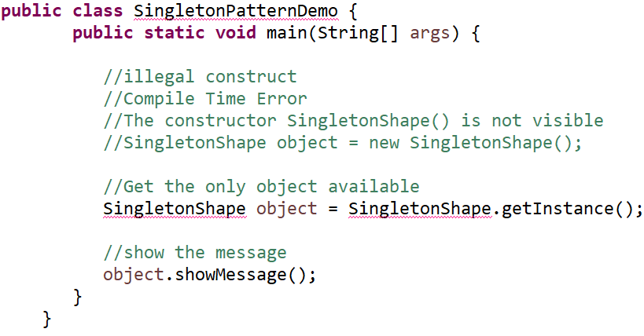
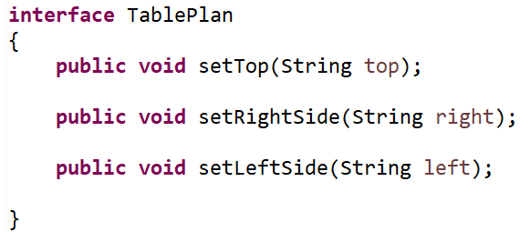
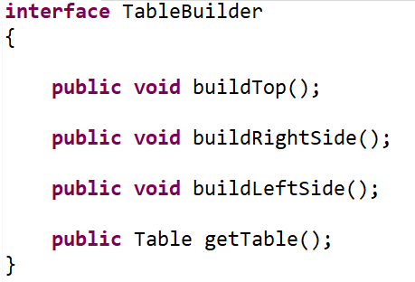
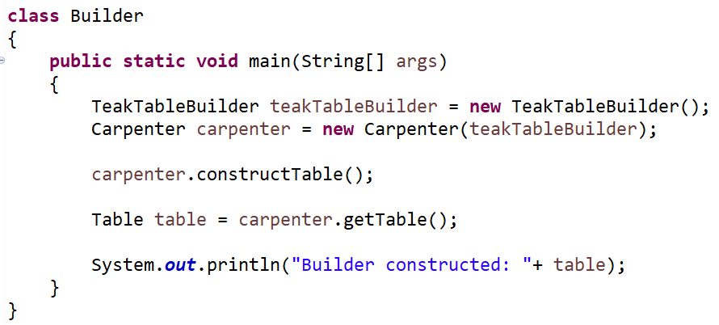

# To Implement Standard Patterns of Object Creation

## Theory

**Creational Patterns** provide object creation mechanisms that increase flexibility and reuse of existing code. Everyone knows that `new` keyword is used to create an object. Sometimes, the nature of the object must be changed according to the nature of the program. In such cases, we must get the help of creational design patterns to provide more general and flexible approach.

Consider the following creational patterns:

---

## Factory Pattern

**Factory** is a creational design pattern that provides an interface for creating objects in a superclass but allows subclasses to alter the type of objects that will be created.

### Need for Factory Pattern

- When a class doesn't know what sub-classes will be required to create  
- When a class wants that its sub-classes specify the objects to be created  
- When the parent classes choose the creation of objects to its sub-classes  

It promotes loose-coupling by eliminating the need to bind application-specific classes into the code.

Say you have a class hierarchy of the form:

Now creating objects through a factory class as follows:

The demo class can be inserted to instantiate the different shapes:

The class `Shape`, `Circle` and `Square` are designed as follows:

The class `ShapeFactory` and `ShapeDemo` are designed as follows:

---

## Singleton Pattern

**Singleton** pattern makes sure that there is only one instance of an object created at any point.

Singleton `Shape` class provides a static method to get its static instance to the outside world.

---

## Builder Pattern

**Builder Pattern**: A Builder class builds the final object step by step. This builder is independent of other objects.

